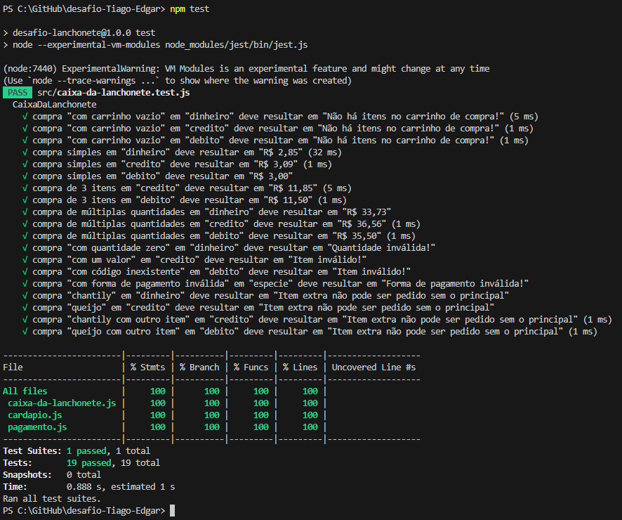

# PROGRAMA START DB 
### DESAFIO CAIXA DA LANCHONETE
### Desenvolvido por Tiago Edgar Rasia

Email: [tiago_rasia@hotmail.com](mailto:tiago_rasia@hotmail.com) 

LinkedIn: [Tiago Rasia](https://www.linkedin.com/in/tiagorasia/).


Você pode conferir o [README Original](https://github.com/rasia83/desafio-Tiago-Edgar/blob/df5e0977ba81d62d48527e13e2c650dde4a64c47/README-original.md) aqui com as instruções para o desenvolvimento deste desafio.
<BR>
<BR>

### DESENVOLVENDO O CÓDIGO

Inicialmente criei dois arquivos, um para as formas de pagamento e seus modificadores, <BR>
e outro para o cardápio com os itens suas descrições, valores e se possuem dependência de um item principal.
```js
export const tabelaPagamento = {
    dinheiro: { descricao: "Dinheiro", modificador: 0.95 },
    debito: { descricao: "Débito", modificador: 1.0 },
    credito: { descricao: "Crédito", modificador: 1.03 },
};
```
```js
export const tabelaValores = {
    cafe: { descricao: 'Café', valor: 3.0, dependencia: null },
    chantily: { descricao: 'Chantily (extra do Café)', valor: 1.5, dependencia: 'cafe' },
    suco: { descricao: 'Suco Natural', valor: 6.2, dependencia: null },
    sanduiche: { descricao: 'Sanduíche', valor: 6.5, dependencia: null },
    queijo: { descricao: 'Queijo (extra do Sanduíche)', valor: 2.0, dependencia: 'sanduiche' },
    salgado: { descricao: 'Salgado', valor: 7.25, dependencia: null },
    combo1: { descricao: '1 Suco e 1 Sanduíche', valor: 9.50, dependencia: null}, 
    combo2: { descricao: '1 Café e 1 Sanduíche', valor: 7.5, dependencia: null }  
};
```
<BR>
Com o método pré-definido que recebe uma forma de pagamento e os itens de um pedido.
```js
calcularValorDaCompra(metodoDePagamento, itens)
```
<BR>

Iniciei validando as informações recebidas.
```js
if (itens === null || (Array.isArray(itens) && itens.length === 0)) {
    return "Não há itens no carrinho de compra!";
}
if (metodoDePagamento === null || !tabelaPagamento[metodoDePagamento]) {
    return "Forma de pagamento inválida!";
}
```
<BR>

Criei meu próprio array itensPedido para ter um maior controle na validação  <BR>
especialmente com os itens extras que dependiam de um item principal .
```js
let itensPedido = [];
for (let itemInfo of itens) {
    let [nome, quantidadeStr] = itemInfo.split(",");

    if (!(nome in tabelaValores)) {
        return "Item inválido!";
    }

    const quantidade = parseInt(quantidadeStr, 10);

    if (quantidade == 0) {
        return "Quantidade inválida!";
    }

    const itemPedido = [nome, quantidade];
    itensPedido.push(itemPedido);
}
```
<BR>

Percorrendo itensPedido efetuei de fato os cálculos do total da compra e apliquei o modificador conforme a forma de pagamento.
```js
for (let item of itensPedido) {
    if (tabelaValores[item[0]].dependencia !== null) {
        let dependenciaFaltando = true;
        itensPedido.forEach((element) => {
            if (element[0].startsWith(tabelaValores[item[0]].dependencia)) {
                dependenciaFaltando = false;
            }
        });
        if (dependenciaFaltando) {
            return "Item extra não pode ser pedido sem o principal";
        }
    }

    let valorItem = parseFloat(tabelaValores[item[0]].valor);
    valorTotal += valorItem * item[1];
}

let modPagamento = tabelaPagamento[metodoDePagamento].modificador;
valorTotal *= modPagamento;
```
<BR>

Para exibir o resultado final estava utilizando o método .toLocaleString() <BR>
mas um dos testes apresentava erro <BR>
Teste >> compra de múltiplas quantidades em "credito" deve resultar em "R$ 36,56" <BR>
valor calculado 36.565 apresentava o resultado errado para o teste  "R$ 36,57 <BR>
para atingir os resultados do arquivo de testes usei o .toFixed() como foi orientado <BR>
e então o .toLocaleString() 
```js
const casasDecimais = 2;
let total2Fixed = valorTotal.toFixed(casasDecimais);
let totalFormatado = parseFloat(total2Fixed).toLocaleString("pt-BR", {
    style: "currency",
    currency: "BRL"
});

return totalFormatado;
```
<BR>



